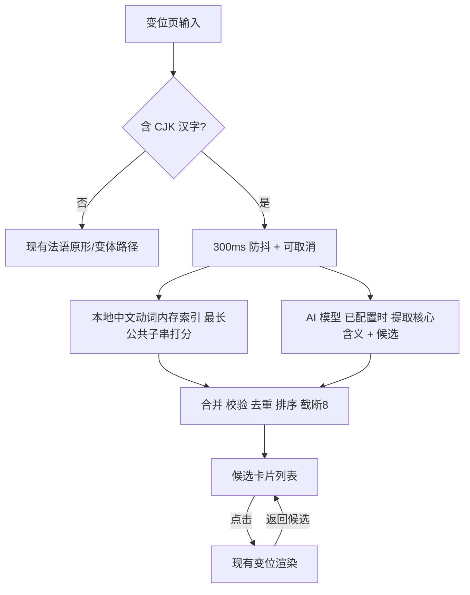

# 变位页中文动词查询

Feature Name: 2026-09-22-conjugation-chinese-search
Updated: 2026-09-22

## Description

在「变位」页（`ConjugationScreen`）新增中文查询通道。用户输入中文（单词词头或短语/短句）后，系统生成含义相同或相近的候选法语动词列表（每项含不定式、词性、中文释义、IPA 音标、简短例句）；用户点选后展示该动词的完整变位内容。法语原形/变体查询路径保持不变。

候选来源采用「本地优先 + AI 补充」：

- 本地：从 `dict` 表约 1 万个带中文释义的动词中做最长公共子串匹配，离线可用。
- AI：已配置模型时，调用模型提取核心动词含义并给出更贴切的候选（含例句与音标）。
- 合并后统一校验（变位引擎可识别）、去重、排序、截断到 8 个。

本设计不修改 `dictionary.db` 结构、不重建 65MB 资产，中文匹配索引在运行时后台驻留内存。

## Architecture



数据流说明：

1. 输入判定用现有 `hasChinese`（`LookupScreen.kt:30`）。
2. 中文查询走候选分支；本地与 AI 并行/顺序获取后合并。
3. 点选候选后把输入替换为不定式并复用现有法语变位渲染。
4. 法语输入完全走原逻辑，不进入候选分支。

## Components and Interfaces

### 新增 1：`ChineseVerbSearch.kt`

纯逻辑 + 编排，便于单元测试。

```kotlin
data class VerbCandidate(
    val infinitive: String,
    val pos: String,
    val meaning: String,
    val ipa: String,
    val example: String = "",
    val source: String            // "local" | "ai"
)

data class CandidateResult(
    val candidates: List<VerbCandidate>,
    val coreMeaning: String = "",
    val aiAttempted: Boolean,
    val aiError: String? = null
)

object ChineseVerbSearch {
    const val MAX_CANDIDATES = 8
    suspend fun find(
        query: String,
        repository: DictRepository,
        conjugator: VerbConjugator,
        aiPrefs: AIPreferences
    ): CandidateResult
}
```

内部拆出可测纯函数：

```kotlin
internal object VerbCandidateRanker {
    // 基于「查询与词典 zh 的最长公共子串」打分；阈值 = min(2, query.length)
    fun rankLocal(rows: List<DbVerbRow>, query: String, limit: Int): List<VerbCandidate>
}

internal object VerbCandidateParser {
    // 宽松解析 AI 回复：去代码块、取 JSON；归一化并校验动词；去重
    fun parse(reply: String, conjugator: VerbConjugator): Pair<String, List<VerbCandidate>>
}

internal object VerbCandidateMerger {
    fun merge(local: List<VerbCandidate>, ai: List<VerbCandidate>, limit: Int): List<VerbCandidate>
}
```

### 新增 2：`DictRepository` 扩展

```kotlin
data class DbVerbRow(val word: String, val pos: String, val zh: String, val en: String)

// 幂等、后台构建；只取带中文释义的动词行（约 1 万条）
fun ensureChineseVerbIndex()

// 用内存索引做最长公共子串匹配，返回本地候选
fun searchVerbsByChinese(query: String, limit: Int = 8): List<DictEntry>
```

实现要点：

- 索引查询：`SELECT word,pos,zh,en FROM dict WHERE zh IS NOT NULL AND zh<>'' AND (pos='verb' OR pos LIKE 'v.%')`。
- 内存驻留 `List<DbVerbRow>`，与现有 `normSet`/`normById`（`DictRepository.kt:47-84`）同一套懒加载 + `synchronized` 模式。
- 子串匹配不能走 SQL 索引（前导通配 `%x%` 无法用 B-tree），放内存扫描：1 万行量级，单次毫秒级。

### 修改 3：`ConjugationScreen`

新增状态：

```kotlin
var chineseMode by remember { mutableStateOf(false) }
var candidates by remember { mutableStateOf<List<VerbCandidate>>(emptyList()) }
var coreMeaning by remember { mutableStateOf("") }
var candLoading by remember { mutableStateOf(false) }
var candError by remember { mutableStateOf<String?>(null) }
var selectedFromCandidates by remember { mutableStateOf(false) }
```

改动点：

- `onValueChange`：若 `hasChinese(q)` → 设置 `chineseMode=true`，防抖 300ms 后调用 `ChineseVerbSearch.find`；否则走现有 `doSearch`。
- 候选列表用 `LazyColumn` + `VerbCandidateCard` 渲染，卡片点击：`selectedFromCandidates=true`，`query=候选.infinitive`，调用现有法语查询逻辑。
- 展示变位结果时，若 `selectedFromCandidates` 则提供「返回候选」按钮，点击清空所选并回到候选列表。
- 现有法语分支（原形 `conjugator.conjugate`、变体 `conjugator.findInfinitive`，`ConjugationScreen.kt:99-128`）保持不动。

候选卡片 `VerbCandidateCard`：不定式（粗体）+ 词性标签 + IPA + 中文释义 + 例句（有则显示）+ 朗读按钮。

### 修改 4：AI 提示词与解析

复用 `AIClient.chat`（`AIClient.kt`）与 `AIPreferences.modelConfig`。提示词要求只输出 JSON：

```json
{"core":"喜欢","candidates":[
  {"word":"aimer","pos":"v.","zh":"喜欢，爱","ipa":"/eme/","example":"J'aime le chocolat."}
]}
```

约束：`word` 必须是动词不定式；按契合度排序；5–8 条；`ipa` 用斜杠包裹；`example` 为一句简短自然的法语例句。同时支持中文词与中文短语：短语时 `core` 填提取出的核心动词含义。

解析（`VerbCandidateParser`）：

1. 去掉 ```json 代码块标记，取首个 `{` 到末个 `}`。
2. 解析 `core` 与 `candidates` 数组；单条字段缺失时容错。
3. 每个 `word`：若 `conjugator.isVerb(word)` 用原词；否则尝试 `conjugator.findInfinitive(word)`；仍无则丢弃。
4. 按 `normalize(infinitive)` 去重；本地候选缺失 IPA 时用 `FrenchIpa.wrap(infinitive)` 补齐。

## Data Models

| 名称 | 字段 | 说明 |
|---|---|---|
| `VerbCandidate` | infinitive, pos, meaning, ipa, example, source | 候选动词卡片数据 |
| `CandidateResult` | candidates, coreMeaning, aiAttempted, aiError | 一次查询的完整结果 |
| `DbVerbRow` | word, pos, zh, en | 本地中文动词索引行 |

合并与排序规则（`VerbCandidateMerger`）：

- AI 可用时：AI 候选按其返回顺序在前，本地候选中未出现的不定式按本地评分追加在后。
- AI 不可用时：本地候选按评分降序。
- 统一按 `normalize(infinitive)` 去重，截断到 `MAX_CANDIDATES=8`。

本地评分（`VerbCandidateRanker`）：

- 分数 = 查询与 `zh` 的最长公共子串长度；阈值 `min(2, query.length)`（单字查询如「爱」要求 1）。
- 排序：公共子串长度降序 → 完全前缀匹配优先 → `zh` 长度升序（短释义更接近核心义）。

## Correctness Properties

- P1：候选列表中每个 `infinitive` 都满足 `conjugator.isVerb(infinitive)`。
- P2：候选列表内 `normalize(infinitive)` 唯一。
- P3：候选数量 ≤ 8。
- P4：含 CJK 的输入不触发法语查询；不含 CJK 的输入不触发候选查询。
- P5：无网络且未配置 AI 时，本地候选仍可生成并点选查看变位。
- P6：候选顺序与相关度单调不增（AI 顺序 + 本地评分）。
- P7：法语输入的变位结果标签页内容与顺序不变。

## Error Handling

| 场景 | 处理 |
|---|---|
| AI 请求异常/超时 | 捕获（`CancellationException` 透传），`aiError` 置提示，保留本地候选 |
| AI 回复非 JSON | `VerbCandidateParser` 返回空 AI 列表，不抛异常 |
| AI 返回非动词/变体 | 归一化后仍无效则丢弃；全部无效按无候选处理 |
| 本地与 AI 均无候选 | UI 空状态：提示 + 重试按钮 + 「配置 AI 可增强」说明 |
| 输入在旧请求返回前变化 | 取消旧 `Job`，丢弃旧结果（复用现有 `searchJob?.cancel()` 模式） |
| 网络不可用 | 本地候选照常展示 |

## Test Strategy

JVM 单元测试（放 `app/src/test/.../ChineseVerbSearchTest.kt`），无需 Android 设备：

- `VerbCandidateRanker`：
  - 词查询「喜欢」命中含「喜欢」的动词；单字「爱」按阈值 1 命中。
  - 短语「我喜欢你」命中「喜欢」类动词。
  - 排序稳定（公共子串更长者在前）、去重、截断。
  - 无共享子串时返回空。
- `VerbCandidateParser`：
  - 标准 JSON、带 ```json 代码块、前后有解释文字三种形态。
  - 非动词/拼写变体被归一化或丢弃；重复词去重；`core` 提取。
- `VerbCandidateMerger`：
  - AI 在前 + 本地去重追加；上限 8；AI 为空时退回本地。
- 回归：新增用例不改变现有 `FrenchIpaTest`、`VerbGroupsPatternTest` 等结果。

手工验证（真机）：

- 输入「喜欢」「吃」「走」「我喜欢你」「去散步」，确认候选合理、可点选、能返回候选列表。
- 未配置 AI 时验证本地候选与提示文案。
- 断网 + 已配置 AI 时验证本地候选仍可用。

## References

[^1]: (`LookupScreen.kt#L30`) - [中文判定 hasChinese 与中文输入分支](../../android/app/src/main/java/com/coolmoonfrench/dict/LookupScreen.kt)
[^2]: (`ConjugationScreen.kt#L99`) - [现有变位查询与展示逻辑](../../android/app/src/main/java/com/coolmoonfrench/dict/ConjugationScreen.kt)
[^3]: (`DictRepository.kt#L131`) - [lookupExact 与内存索引模式](../../android/app/src/main/java/com/coolmoonfrench/dict/DictRepository.kt)
[^4]: (`AiWordSearch.kt#L19`) - [现有 AI 查词调用与 JSON 解析样例](../../android/app/src/main/java/com/coolmoonfrench/dict/AiWordSearch.kt)
[^5]: (`TranslationAssist.kt#L20`) - [AI 优先、MyMemory 兜底的翻译辅助](../../android/app/src/main/java/com/coolmoonfrench/dict/TranslationAssist.kt)
[^6]: (`VerbConjugator.kt#L75`) - [isVerb / findInfinitive 接口](../../android/app/src/main/java/com/coolmoonfrench/dict/VerbConjugator.kt)
[^7]: (`FrenchIpa.kt`) - [离线 IPA 推导，用于本地候选补齐音标](../../android/app/src/main/java/com/coolmoonfrench/dict/FrenchIpa.kt)
